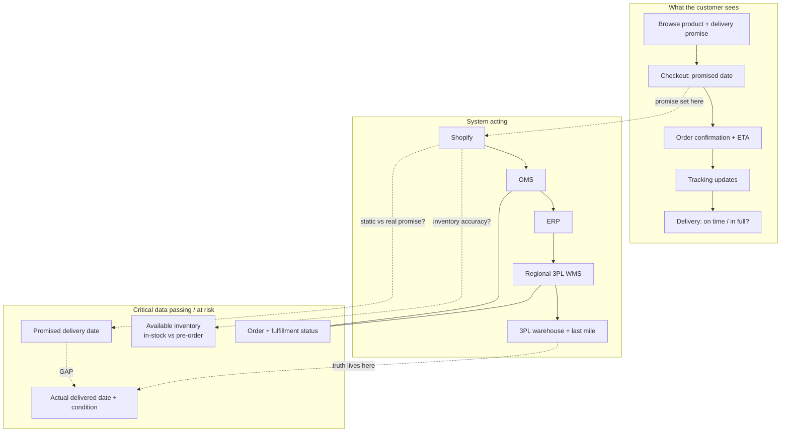

# Recommendation Memo: Improving the Customer Delivery Experience

**To:** Leadership
**From:** [Candidate], Systems Product Manager
**Re:** Initial direction to improve delivery experience, first 90 days
**Status:** Recommendation for discussion

---

## Recommendation up front

We should **not** start by re-architecting our systems. We should start by agreeing on **one trusted measure of the customer's delivery experience**, using it to find *where* the experience actually breaks, and shipping one or two targeted fixes, all within existing engineering capacity. System consolidation is likely the right long-term direction, but it is a multi-quarter program and the wrong thing to commit to in the first quarter.

The core problem is most likely **not delivery speed**. It is the **gap between the delivery date we PROMISE the customer and what we actually deliver**, made worse because no single system or team owns that promise end to end. That is why our internal SLA can improve while customers grow unhappier.

---

## 1. What I believe is happening

The most important signal in the brief is a contradiction: **internal delivery SLA metrics improved, yet complaints rose, support tickets are up 40%, and conversion fell.** When internal numbers get better while customers get louder, it almost always means we are measuring the wrong thing, or measuring from the wrong reference point. Our SLA is probably measured from an internal handoff (e.g. dispatch) against an internally-set target, while the customer lives in a different number entirely: *did my order arrive when you told me it would, complete and undamaged.*

My working hypothesis, to be validated in the first three weeks, not assumed, has three parts:

**1. The pain is predictability, not speed.** The damage is concentrated in the gap between the promise shown at checkout and the actual doorstep outcome. A customer who is told "3 days" and gets it in 5 is more damaging to trust and conversion than one told "6 days" and gets it in 5.

**2. There is no single trusted source of truth across the stack.** Orders flow Shopify → OMS → ERP → regional 3PL WMS → 3PL warehouse / last mile, and each team reads a different system. So the *same order* can look healthy to Operations and broken to the customer. This is why "teams disagree on which systems and metrics should be trusted", they are each locally correct against different data. It also explains the stakeholder conflict: Marketing wants tighter promises to lift conversion; Operations wants looser promises to protect SLA. Both are optimising a local metric because **no one owns the end-to-end promise.**

**3. Pre-orders and inventory inaccuracy corrupt the promise at its source.** An item shown "in stock" that isn't, or a single pre-order line that quietly holds an entire mixed order under a default **ship-complete policy** (the whole order waits for its slowest line before anything ships), will blow past the displayed timeline regardless of how fast the warehouse moves. In other words, the bottleneck is order composition and fulfilment policy, not warehouse speed, another way internal metrics can look healthy while the customer's promise is missed.

**The uncomfortable part, where I'd respectfully challenge leadership's framing:** "fragmented systems and processes" is a real symptom, but the deeper cause looks like an **ownership and definitions gap**, not just a technical one. No role today owns the end-to-end delivery promise or the single definition of "on time." Without that, the loudest team, not the data, sets the roadmap.

**Early external signal.** A quick scan of public customer channels (including Secretlab's own subreddit) corroborates several of these points: recurring posts cluster around (a) products arriving with issues or damage, (b) poor customer-service resolution, and (c) pre-order items holding up the rest of an order. This is qualitative and self-selected, not proof, but it independently agrees with both the case study's signals and the hypotheses above. It also surfaces one failure mode worth naming explicitly: **physical damage in transit.** That is captured by the "in full, without defect" leg of the North Star, but the fix lives in packaging and 3PL / last-mile handling, not in systems or data, an honest reminder that not all of this is a systems problem.

*I am holding fragmentation as a hypothesis, not a conclusion. Section 3 describes how I'd confirm it cheaply before spending engineering on anything.*

**Alternative explanations, and where this stops being a systems problem.** I am deliberately not assuming the conversion decline was caused by delivery. Before committing engineering, I would discriminate between rival explanations: (1) **reputation spillover**, the delivery and service complaints leaking into reviews and deterring new buyers; (2) **availability**, certain products genuinely out of stock or pre-order only; (3) **traffic mix**, a campaign shifting the denominator so conversion rate falls even though the product did not change; (4) **commercial**, a competitor move, price change, or promotion ending; and (5) **checkout friction**, a recent UI/UX change (testable against the date conversion dipped). The diagnosis in Section 3 is built to tell these apart. Where the cause is ours (promise accuracy, availability data) we fix it; where it is commercial or a checkout-UX regression, I route it to the right owner rather than spend scarce engineering misdiagnosing it as a systems issue. The point is range with focus: rule out broadly, commit narrowly.

---

## 2. What I recommend (the first 90 days)

A disciplined sequence: **establish truth → diagnose → fix the highest-impact slice → assign ownership.**

**Month 1: One trusted metric + diagnosis (mostly analysis, minimal engineering).**
- Define and stand up a **North Star: Delivery Promise Reliability**, the % of orders delivered on or before the promised date, in full, without defect (industry shorthand: customer-promise **OTIF**). Build it from the **existing data warehouse**; do not introduce new systems. This is an **apex metric, not a replacement**, each department keeps the metrics it owns, but they are now understood as contributors that *roll up to and explain* the North Star rather than competing definitions of "good." What makes it trusted is a single agreed **definition** of "on time" (promised date vs. actual delivered date, from the customer's view, not an internal handoff) and a single agreed **data source**. See Appendix C for how each team's metric and source maps in.
- **Categorise the 40% ticket spike by reason code.** This needs *zero* engineering and, within days, tells us whether the pain is timing, damage/defects, wrong items, or order-visibility. It can reframe the whole problem before we spend a sprint.
- Segment the promise-vs-actual gap by **region** and **product type (in-stock vs pre-order)** to locate where the experience actually breaks.

**Month 2: One or two targeted, low-engineering fixes** aimed at wherever Month 1 says the gap is worst. Likely candidates:
- Make the **checkout promise reflect reality**, inventory state and pre-order status, using simple rules, not a full available-to-promise engine.
- **Pre-order delay alerting** so the relevant team intervenes *before* the customer feels the slip.
- **Decouple pre-order from in-stock lines** (split shipment, or at minimum a clear choice at checkout) so a single pre-order item stops holding back the rest of an order. This is the ship-complete failure mode, corroborated by both the brief and public customer posts.
- Fix the single worst data discrepancy feeding the promise.

**Month 3: Governance and sequencing.**
- Assign **single ownership** of the delivery-promise metric and definition (ends the "whose number is right" fight).
- Publish **one shared dashboard** so every team sees the same picture.
- Lay out the **multi-quarter direction** toward a single source of truth, named as the destination, explicitly deferred, not started this quarter.

**Explicitly NOT in the first 90 days** (and why): system/ERP consolidation, perfect inventory accuracy, and re-doing 3PL integrations. Each is a multi-quarter program; starting one now would consume our limited engineering for no near-term customer impact.

---

## 3. How I would approach the problem

**Discovery first (weeks 1–3).** Three lightweight artifacts that double as alignment tools:
- **Order-lifecycle service blueprint** (Appendix A), the order journey end to end, mapping at each step what the *customer* sees, which *system* acts, and what *data* passes. This is where the promise is set and where it diverges from reality becomes visible.
- **System-of-record / data-lineage map** (Appendix B), for each critical data element (available inventory, promised date, order status, actual delivery), which system is authoritative, who consumes it, and where they disagree. This directly attacks the trust problem.
- **Stakeholder interviews** with Marketing, Operations, Support, and Engineering/Data, framed by **Jobs-to-be-Done** ("what are you judged on, where does the data lie to you?") and **5 Whys** to reach root cause rather than symptom.

**Decide with data, prioritise transparently.** Score candidate fixes with **ICE/RICE**, Reach matters here because the gap hides inside specific regions and product lines. Aligning everyone on shared definitions *first* is what stops the loudest voice from steering the roadmap.

**Operate in the open.** Each quarter gets one business outcome; each sprint a clear objective toward it. Agile and reprioritised as discovery and the tech team's input simplify the path, but anchored to the customer-promise metric throughout.

---

## Key assumptions & risks

- **Assumption:** the data warehouse holds order and delivery timestamps sufficient to reconstruct promise-vs-actual. If not, the first sprint instruments this, it is the prerequisite for everything else.
- **Assumption:** the conversion drop is concentrated in low-stock, pre-order, or conservatively-timed products. The Month 1 segmentation tests this directly.
- **Risk:** regional differences (different payment gateways, different 3PL WMS) make a single unified metric harder. Mitigation: start with the one or two highest-volume regions, prove the metric, then extend.
- **Risk:** committing to "fragmentation" as the root cause too early. Mitigation: the weeks 1–3 diagnosis exists precisely to confirm or kill it before engineering spend.

---

*Appendices follow (excluded from page count): A: Order-lifecycle service blueprint · B: System-of-record map · C: Metric tree · D: 90-day plan on a page.*

---

# Appendix A: Order-lifecycle service blueprint

**Read of the blueprint:** the promise is *set* at checkout (Shopify) but the *truth* only exists at the end (last mile). The "GAP" between the promised date (D2) and the actual delivered outcome (D4) is the customer's experience, and today nothing measures it end to end.

---

# Appendix B: System-of-record / data-lineage map

| Critical data element | Authoritative system (likely) | Who consumes it | Where it diverges / risk |
|---|---|---|---|
| Available inventory (in-stock vs pre-order) | ERP / WMS | Shopify (to generate the checkout delivery promise), Marketing, Ops | Shopify may show stale/optimistic stock → false promise |
| Promised delivery date | Shopify (display) | Customer, Support, Marketing | Often static/rules-of-thumb, not tied to real fulfillment state |
| Order & fulfillment status | OMS / WMS | Ops, Support | Mixed in-stock + pre-order orders; status differs per system |
| Actual delivered date + condition | 3PL / last-mile | (often no one, end to end) | The real customer truth, frequently not flowed back to a metric |

*This table is a hypothesis to confirm in discovery; the "authoritative system" column is what interviews and the data team should validate first.*

---

# Appendix C: Metric tree

**The apex.** One customer-facing number everyone aligns to; departmental metrics roll up to and *explain* it.

- **North Star (customer-facing, lagging):** Delivery Promise Reliability, % orders delivered on/before promised date, in full, without defect (customer-promise OTIF).
- **Leading indicators:** promise-vs-actual gap (days); pre-order promise accuracy; inventory accuracy by system/region; % orders containing a pre-order line.
- **Operational / diagnostic:** support tickets by reason code; pre-order delay alerts (act before the customer feels the slip); conversion by product stock-state.

**How each department's metric feeds the apex, and from which source.** This is the wiring that turns competing numbers into one shared picture. (Source systems are the likely owners, to be confirmed in discovery.)

| Department | Metric they own | Source system | How it rolls up to / explains OTIF |
|---|---|---|---|
| Marketing | Conversion by displayed delivery timeline; promise competitiveness | Shopify analytics + data warehouse | A wrong or over-conservative promise depresses conversion; explains conversion drops |
| Operations / Fulfilment | On-time dispatch, pick-pack-ship cycle time, internal SLA | OMS / WMS | Internal fulfilment speed is *one input* to whether the customer promise is met (not the promise itself) |
| Customer Support | Ticket volume by reason code; delivery-related contact rate | Ticketing tool (e.g. Zendesk) + data warehouse | Leading signal of promise failures customers actually feel; the fastest, cheapest diagnostic |
| Supply / Inventory | Inventory accuracy; pre-order fill rate; stockout rate | ERP / WMS | Inaccurate stock = a false promise at the source; directly widens the gap |
| Last-mile / 3PL | Actual delivered date; delivery success & defect rate | 3PL / last-mile feeds + data warehouse | The *actual* side of promise-vs-actual; the customer's ground truth |
| Engineering / Data | Cross-system data latency; reconciliation discrepancies | Data warehouse / pipelines | Determines whether any of the above can be trusted at all, the precondition for the apex |

---

# Appendix D: 90-day plan on a page

| Month | Outcome | Key moves | Engineering load |
|---|---|---|---|
| 1 | One trusted metric + clear diagnosis | Define & stand up OTIF from data warehouse; tag 40% ticket spike by reason code; segment gap by region & product type | Low (mostly analysis) |
| 2 | One or two targeted fixes live | Promise reflects inventory/pre-order reality (rules-based); pre-order delay alerting; fix worst data discrepancy | Low–medium |
| 3 | Ownership + shared truth + direction set | Assign owner of the promise metric; ship one shared dashboard; publish deferred multi-quarter unification roadmap | Low |
