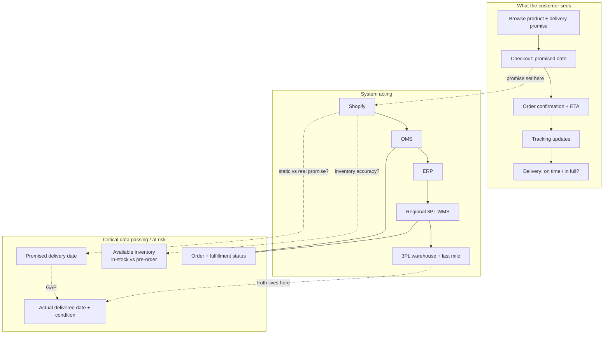

# Recommendation Memo: Improving the Customer Delivery Experience

**To:** Leadership
**From:** [Candidate], Systems Product Manager
**Re:** Initial direction to improve delivery experience, first 90 days
**Status:** Recommendation for discussion

---

## Recommendation up front

The delivery-experience problems are the visible symptom of two weak system backbones, **order management (OMS)** and **product information (PIM)**, the two initiatives this role owns. I would **not** big-bang either in the first quarter. The first 90 days should **scope, diagnose, and sequence** the OMS upgrade and PIM rollout around the highest-impact pain, establish **one end-to-end measure**, and ship **one or two quick wins** that do not need the full platform, so the build that follows is targeted, adopted, and measurable.

The core problem is **not delivery speed**. It is that what we lead customers to expect, both the **delivery commitment** (OMS) and the **product information** they buy on (PIM), diverges from what they receive, and **no system owns the end-to-end truth**, so internal SLAs improve while customers grow unhappier. I anchor on OMS/PIM but reasoned from the customer pain outward, not from the systems back: a meaningful share of the problem sits outside both (see end of Section 1), and the 90 days size that split before any build.

---

## 1. What I believe is happening

The key signal is a contradiction: **internal SLA improved, yet complaints rose, tickets are up 40%, and conversion fell.** When internal numbers improve while customers get louder, we are measuring **legs, not the journey**: each system tracks its slice, no one measures order-to-doorstep as the customer lives it. The pain splits into **two system-shaped clusters**, which is why the role rolls out two platforms.

**Cluster 1, the delivery commitment is unbacked (OMS-shaped).** The checkout promise is not backed by reliable availability or status data, and the mechanism differs by market: Singapore lets the customer pick a date (generally kept), while the US and UK show an **estimated date range** via FedEx/UPS that depends on processing time and a last mile we do not control, so it slips. Pre-orders behave differently again: a single pre-order line under a default **ship-complete policy** holds an entire mixed order, so in-stock items wait on the slowest line. The result: unreliable estimates concentrated in **pre-orders and mixed orders**, and no source of truth for "where is my order." This is what an OMS fixes.

**Cluster 2, product information is inconsistent (PIM-shaped).** Inconsistent product data across regions and channels drives **expectation-driven returns** ("not what the page led me to expect"). A PIM fixes expectation accuracy, **not** physical damage in transit, which is a packaging and 3PL issue owned by Operations.

**A deliberate correction on the 40% tickets.** Public customer signal (Appendix A) skews toward **returns and faulty/damaged product**, not delivery delays, so I am *not* pinning the spike on delivery visibility. The Month 1 reason-code split sizes it before we commit engineering.

**The challenge, and the boundary.** "Fragmented systems" is the symptom; the deeper gap is **ownership and definition**, no role owns the end-to-end experience or a single definition of "on time," so the loudest team sets direction. That is why OMS/PIM exist, and the risk is running them as IT projects detached from customer outcomes. They will not fix everything: physical damage, last-mile performance, the returns process, duties/taxes, and checkout UX route to Operations, the 3PLs, and Web/Commercial. I hold all of this as **hypotheses to validate in weeks 1–3**, not conclusions.

---

## 2. What I recommend (the first 90 days)

The first 90 days are the **scoping and sequencing phase** of the OMS/PIM program, not a big-bang: **measure and diagnose → translate into a prioritised backlog → ship quick wins → sequence the rollout with a change plan.**

**Month 1, measure and diagnose (mostly analysis).**
- Stand up the **end-to-end North Star** (customer-promise **OTIF**) from the existing data warehouse; decompose the order-to-doorstep clock by leg and region (Appendix B).
- **Categorise the 40% tickets by reason code** (zero engineering) to split delivery vs returns vs damage.
- Segment the gap by region, product type, and stock-state to locate the worst pain.

**Month 2, quick wins now, scope platforms in parallel.**
- Quick wins without the full platform: make the **checkout commitment honest** for pre-order/mixed orders, **decouple in-stock from pre-order lines**, add **proactive delay comms**, and fix the worst product-data inaccuracies.
- In parallel, **translate the diagnosis into phase-1 requirements** for the OMS (order-status source of truth + availability-backed promising) and PIM (master data for top SKUs/regions).

**Month 3, sequence, govern, adopt.**
- Lock the **phased OMS/PIM roadmap** by customer impact (Appendix C), each phase tied to OTIF, not go-live.
- Stand up **one shared dashboard** and **assign metric ownership** (ends the "whose number is right" fight).
- Define the **change-management/adoption plan** and the **continuous-improvement loop**.

**Explicitly not now:** a big-bang cutover, perfect inventory accuracy, re-doing 3PL integrations, fixing damage/packaging (Operations), or redesigning reverse logistics. Each burns limited engineering for no near-term impact.

---

## 3. How I would approach the problem

This mirrors the lifecycle the role owns: **scope → translate → execute → adopt → improve.**

**Scope (weeks 1–3)** with three lightweight artifacts that double as requirements-gathering: the **order-lifecycle service blueprint** (Appendix D), the **system-of-record / data-lineage map** (Appendix E), and **stakeholder interviews** (Marketing, Ops, Support, Supply, Eng/Data) framed by **Jobs-to-be-Done** and **5 Whys**.

**Translate** the diagnosis into prioritised OMS/PIM capabilities with acceptance criteria, scored with **ICE/RICE** (Reach matters: the pain hides in specific regions and product lines). I rule out rival explanations for the conversion drop before committing engineering (Appendix F).

**Bridge and adopt:** one agreed definition and metric ends the loudest-voice problem; training, comms, and a phased cutover are what make the systems adopted, not just delivered.

**Improve continuously:** measure each phase against the end-to-end OTIF clock post-implementation and reprioritise as the technical team simplifies the path.

---

## Key assumptions & risks

- **Assumption:** the OMS is **upgraded** (not greenfield) and the PIM is a **new rollout**; both phase as configure-and-integrate work, which keeps them feasible under limited engineering.
- **Assumption:** the data warehouse holds enough order/delivery timestamps to reconstruct the end-to-end clock; if not, sprint one instruments it.
- **Risk:** the rollout becomes a big-bang IT project. *Mitigation:* sequence by customer impact, tie to OTIF, not go-live.
- **Risk:** systems delivered but not adopted. *Mitigation:* change-management owned from day one.
- **Risk:** committing to a root cause too early. *Mitigation:* the weeks 1–3 diagnosis and reason-code split confirm or kill each hypothesis first.

---

*Appendices follow (excluded from page count): A: External signal (customer-channel scan) · B: Metric tree · C: OMS/PIM rollout sequenced by customer impact · D: Order-lifecycle service blueprint · E: System-of-record map · F: Alternative explanations and scope · G: 90-day plan on a page.*

---

# Appendix A: External signal (public customer-channel scan)

A quick scan of public customer channels (including Secretlab's own subreddit) was used as a qualitative gut-check against the brief. It is self-selected and not representative, so it is treated as corroboration to be confirmed by Month 1 data, not as proof. Three themes recur:

| Recurring theme | What it corroborates | Systems issue? |
|---|---|---|
| Products arriving with issues or damage | The "in full, without defect" leg of the North Star | Partly. Root fix is packaging and 3PL / last-mile handling, not systems |
| Complaints about returns and faulty product | The 40% ticket spike skews here, toward returns and condition, not delivery delays | Split: expectation-driven returns → PIM; physical damage and returns process → Operations / 3PL |
| Pre-order items holding up the rest of an order | The ship-complete failure mode (Section 1, Cluster 1) | Yes: an OMS-shaped gap (fulfilment policy plus order composition) |

Takeaway: the brief's signals are echoed by real customers, and the support pain skews toward returns and damage rather than delivery delays. A useful correction: the ticket spike is largely the PIM/returns cluster and physical handling, not delivery visibility, and the reason-code split in Month 1 confirms the proportions before any engineering is committed.

---

# Appendix B: Metric tree

**The apex.** One customer-facing number everyone aligns to; departmental metrics roll up to and *explain* it.

- **North Star (customer-facing, lagging):** Delivery Promise Reliability, % orders delivered on/before promised date, in full, without defect (customer-promise OTIF).
- **Leading indicators:** promise-vs-actual gap (days); pre-order promise accuracy; inventory accuracy by system/region; % orders containing a pre-order line.
- **Operational / diagnostic:** support tickets by reason code; pre-order delay alerts (act before the customer feels the slip); conversion by product stock-state.

**How each department's metric feeds the apex, and from which source.** This is the wiring that turns competing numbers into one shared picture. (Source systems are the likely owners, to be confirmed in discovery.)

| Department | Metric they own | Source system | How it rolls up to / explains OTIF |
|---|---|---|---|
| Marketing | Conversion by displayed delivery timeline; promise competitiveness | Shopify analytics + data warehouse | A wrong or over-conservative promise depresses conversion; explains conversion drops |
| Operations / Fulfilment | On-time dispatch, pick-pack-ship cycle time, internal SLA | OMS / WMS | Internal fulfilment speed is *one input* to whether the customer promise is met (not the promise itself) |
| Customer Support | Ticket volume by reason code; delivery-related contact rate | Ticketing tool (e.g. Zendesk) + data warehouse | Leading signal of promise failures customers actually feel; the fastest, cheapest diagnostic |
| Supply / Inventory | Inventory accuracy; pre-order fill rate; stockout rate | ERP / WMS | Inaccurate stock = a false promise at the source; directly widens the gap |
| Last-mile / 3PL | Actual delivered date; delivery success & defect rate | 3PL / last-mile feeds + data warehouse | The *actual* side of promise-vs-actual; the customer's ground truth |
| Engineering / Data | Cross-system data latency; reconciliation discrepancies | Data warehouse / pipelines | Determines whether any of the above can be trusted at all, the precondition for the apex |

---

# Appendix C: OMS / PIM rollout, sequenced by customer impact

The rollout is phased so each step closes a diagnosed pain and is measured against the OTIF clock, not against go-live. This is the business-to-technical translation and sequencing the role owns.

| Phase | System | Capability | Customer pain it closes | Why this order |
|---|---|---|---|---|
| 1 | OMS | Single source of truth for order + fulfilment status | "Where is my order"; CS and customers cannot get certainty | Foundation the shared dashboard and every later phase depend on |
| 1 | OMS | Availability-backed (ATP) promising for pre-order/mixed orders | Delivery estimates that slip or cannot be trusted; ship-complete holds | Highest-acuity delivery pain; concentrated in pre-orders and mixed orders |
| 1 | PIM | Master product data for top SKUs and regions | Expectation-driven returns from inconsistent product info | Cuts the returns slice of the 40% ticket spike |
| 2 | OMS | Fulfilment orchestration (split shipment, regional carrier logic) | In-stock items held by pre-order lines; region-specific promises | Builds on the phase-1 status + ATP foundation |
| 2 | PIM | Channel/region content syndication | Inconsistent listings across markets feeding wrong expectations | Extends accurate data once the master record exists |
| 3 | OMS | Returns orchestration | Slow, painful reverse logistics | Sequenced last; needs the order source of truth first |

*Out of scope for these systems (routed to other owners): physical damage and packaging (Operations, 3PL), surprise duties/taxes and checkout UX (Commercial, Web), and carrier last-mile performance (3PL management).*

---

# Appendix D: Order-lifecycle service blueprint

**Read of the blueprint:** the promise is *set* at checkout (Shopify) but the *truth* only exists at the end (last mile). The "GAP" between the promised date (D2) and the actual delivered outcome (D4) is the customer's experience, and today nothing measures it end to end.

---

# Appendix E: System-of-record / data-lineage map

| Critical data element | Authoritative system (likely) | Who consumes it | Where it diverges / risk |
|---|---|---|---|
| Available inventory (in-stock vs pre-order) | ERP / WMS | Shopify (to generate the checkout delivery promise), Marketing, Ops | Shopify may show stale/optimistic stock → false promise |
| Promised delivery date | Shopify (display) | Customer, Support, Marketing | Often static/rules-of-thumb, not tied to real fulfillment state |
| Order & fulfillment status | OMS / WMS | Ops, Support | Mixed in-stock + pre-order orders; status differs per system |
| Actual delivered date + condition | 3PL / last-mile | (often no one, end to end) | The real customer truth, frequently not flowed back to a metric |

*This table is a hypothesis to confirm in discovery; the "authoritative system" column is what interviews and the data team should validate first. Target-state ownership, where the OMS becomes the source of truth for order/availability/status and the PIM for product data, is in Appendix C.*

---

# Appendix F: Alternative explanations and scope

I am deliberately not assuming the conversion decline was caused by delivery. The discovery in Section 3 is built to discriminate between rival explanations before any engineering is committed. The principle is range with focus: rule out broadly, commit narrowly. Where the cause is ours we fix it; where it is commercial or a checkout-UX regression, I route it to the right owner rather than spend scarce engineering misdiagnosing it as a systems problem.

| Rival hypothesis | What it would look like | How I'd discriminate | Likely owner of the fix |
|---|---|---|---|
| Reputation spillover | Delivery/service complaints leaking into reviews and deterring new buyers | Correlate review sentiment/volume timing against the conversion dip | Systems / CX (fix the root delivery problem) |
| Availability | Certain products genuinely out of stock or pre-order only | Segment conversion by stock-state (in-stock vs pre-order vs OOS) | Supply / Merchandising |
| Traffic mix | A campaign shifted the denominator, so rate falls though the product did not change | Segment conversion by traffic source/campaign; inspect session composition | Marketing |
| Commercial | A competitor move, price change, or promotion ending | Competitor and price-change review; check promo calendar against the dip | Commercial / Pricing |
| Checkout friction | A recent UI/UX change raising abandonment | Funnel analysis; align the dip date with the release log | Web / Growth |

*Scope line for the room: I own the diagnosis of the whole, but commit to build only the systems slice (promise accuracy, the single source of truth for order status/ETA, and the pre-order fixes). The rest I orchestrate by routing to the right owner with data.*

---

# Appendix G: 90-day plan on a page

| Month | Outcome | Key moves | Engineering load |
|---|---|---|---|
| 1 | End-to-end measure + clear diagnosis | Stand up OTIF from data warehouse, decompose clock by leg/region; tag 40% tickets by reason code; segment by region/product/stock-state | Low (mostly analysis) |
| 2 | Quick wins live + platforms scoped | Honest pre-order/mixed-order commitment + decouple lines + proactive comms + fix worst product data; translate diagnosis into OMS/PIM phase-1 requirements | Low–medium |
| 3 | Rollout sequenced, owned, adoption-planned | Lock phased OMS/PIM roadmap (Appendix C) tied to OTIF; ship shared dashboard + assign metric owner; change-management + continuous-improvement plan | Low–medium |
