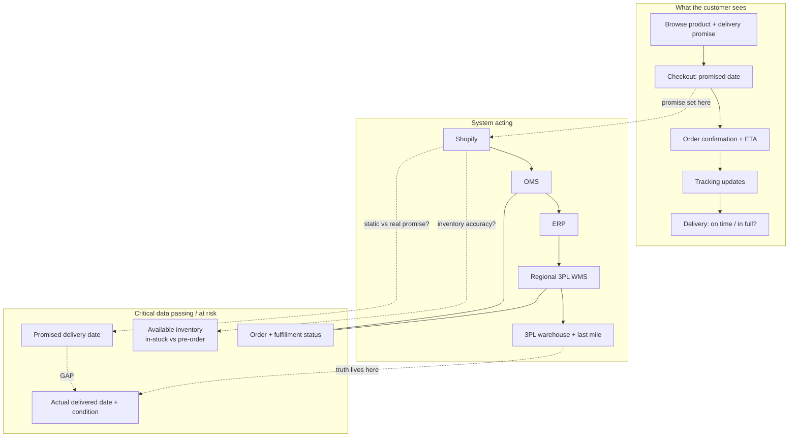

# Recommendation Memo: Improving the Customer Delivery Experience

**To:** Leadership
**From:** [Candidate], Systems Product Manager
**Re:** Initial direction to improve delivery experience, first 90 days
**Status:** Recommendation for discussion

---

## Recommendation up front

The delivery-experience problems are the visible symptom of two weak system backbones: **order management (OMS)** and **product information (PIM)**, the two initiatives this role is mandated to own. I would **not** attempt a big-bang rollout of either in the first quarter. Instead, the first 90 days should **scope, diagnose, and sequence** the OMS upgrade and PIM rollout around the highest-impact customer pain, establish **one end-to-end measure** of the experience, and ship **one or two quick wins** that do not need the full platform, so the build that follows is targeted, adopted, and measurable.

The core problem is **not delivery speed**. It is that what we lead customers to expect, both the **delivery commitment** (when and how an order arrives) and the **product information** they buy on, diverges from what they actually receive, and **no system owns the end-to-end truth**. The **OMS** closes the order and delivery-commitment gap: one source of truth for order status, availability-backed promising, and pre-order/mixed-order orchestration. The **PIM** closes the product-information gap: consistent, accurate product data across regions and channels, which reduces expectation-driven returns. This is why internal SLAs can improve while customers grow unhappier: we measure individual system legs, not the customer's end-to-end journey.

A note on framing: although I anchor the recommendation on the OMS and PIM, I did not start from those systems and reason backward. I worked from the customer pain outward, and deliberately looked beyond OMS and PIM. A meaningful share of the problem sits outside both (covered at the end of Section 1), and the first 90 days are built to size that split with data before committing to any build.

---

## 1. What I believe is happening

The most important signal in the brief is a contradiction: **internal delivery SLA metrics improved, yet complaints rose, support tickets are up 40%, and conversion fell.** When internal numbers improve while customers get louder, we are almost always measuring **legs, not the journey**: each system tracks its own slice while no one measures order-placed-to-delivered as the customer experiences it.

Underneath the noise, the pain decomposes into **two system-shaped clusters**, which is exactly why the role is mandated to roll out two platforms.

**Cluster 1: the delivery commitment is unbacked (an OMS-shaped gap).** What we promise at checkout is not backed by reliable availability or status data, and the mechanism differs by market. In Singapore the customer selects a specific delivery date that is generally kept. In the US and UK, checkout instead shows an **estimated delivery date range** (for example, "Receive by estimated 18 to 23 June") tied to a shipping tier and fulfilled by FedEx/UPS, an estimate that depends on both order-processing time and a carrier last mile we do not fully control, so it can slip. The checkout itself flags that priority processing applies to **in-stock** items, which means pre-orders behave differently: a single **pre-order line under a default ship-complete policy** can hold an entire mixed order, so in-stock items wait on the slowest line. The result: estimates that slip or cannot be trusted, concentrated in **pre-orders and mixed orders**, and no single source of truth for "where is my order." This is what an OMS exists to fix.

**Cluster 2: product information is inconsistent (a PIM-shaped gap).** Inconsistent or inaccurate product data across regions and channels feeds **expectation-driven returns** ("not what the page led me to expect"). This is what a PIM exists to fix. The honest boundary: a PIM addresses expectation accuracy, **not** physical damage in transit, which is a packaging and 3PL-handling problem owned by Operations.

**On the 40% ticket spike, a deliberate correction.** Public customer signal (Appendix F) suggests the support pain skews toward **returns and faulty/damaged product**, not delivery delays. So I am *not* attributing the ticket spike primarily to delivery visibility. Some of it is the product-information/returns cluster, some is genuine physical damage (outside systems scope). The Month 1 **ticket reason-code categorisation** settles the split before we commit engineering.

**The uncomfortable part, where I'd respectfully challenge leadership's framing:** "fragmented systems" is the symptom; the deeper gap is **ownership and definition**. No role owns the end-to-end experience or a single definition of "on time," so the loudest team, not the data, sets direction. That is the real reason the OMS and PIM rollouts exist, and the real risk is running them as IT projects disconnected from customer outcomes. I hold all of the above as **hypotheses to validate in weeks 1–3**, not conclusions.

**What OMS and PIM will not fix.** A meaningful share of the pain sits outside both systems: physical damage and packaging quality, last-mile carrier performance, the returns (reverse-logistics) process itself, import duties and taxes, and checkout UX. These route to Operations, the 3PLs, and the Web/Commercial teams. The Month 1 reason-code split sizes how much of the problem is OMS/PIM-addressable versus not, so we never claim two systems fix everything.

---

## 2. What I recommend (the first 90 days)

The first 90 days are the **scoping and sequencing phase** of the OMS and PIM program, not a big-bang rollout. The sequence: **measure and diagnose → translate into a prioritised systems backlog → ship quick wins → sequence the phased rollout with a change-management plan.**

**Month 1: Establish the measure and diagnose (mostly analysis, minimal engineering).**
- Stand up the **end-to-end North Star** (Delivery Promise Reliability, the customer-promise **OTIF**) from the **existing data warehouse**, and decompose the order-to-doorstep clock **by leg and region** to see where time and variance actually accrue (Appendix C).
- **Categorise the 40% ticket spike by reason code** (zero engineering) to split delivery-status vs returns vs damage.
- Segment the gap by **region, product type (in-stock vs pre-order), and stock-state** to locate the worst pain.

**Month 2: Quick wins now, scope the platforms in parallel.**
- Quick wins that do **not** need the full platform: make the **checkout commitment honest** for pre-order and mixed orders (rules-based, show an updating window rather than a false precise date), **decouple in-stock from pre-order lines**, add **proactive delay comms** for pre-orders and mixed orders, and correct the **worst product-data inaccuracies** feeding the storefront.
- In parallel, **translate the diagnosis into prioritised requirements** for **OMS phase 1** (single source of truth for order status + availability-backed promising) and **PIM phase 1** (master product data for top SKUs and regions). This is the business-to-technical translation the role owns.

**Month 3: Sequence, govern, and plan adoption.**
- Lock the **phased OMS/PIM rollout roadmap** sequenced by customer impact (Appendix G), each phase tied to a business outcome and the OTIF measure, not to go-live.
- Stand up **one shared dashboard** as the interim single source of truth and **assign ownership** of the end-to-end metric (ends the "whose number is right" fight).
- Define the **change-management and adoption plan** (who uses what, training, phased cutover) and the **continuous-improvement loop** that measures the rollout against customer outcomes post-implementation.

**Explicitly NOT in the first 90 days** (and why): a big-bang OMS or PIM cutover, perfect inventory accuracy, re-doing 3PL integrations, fixing physical damage/packaging (Operations), or redesigning reverse logistics (routed; the OMS can orchestrate returns in a later phase). Each would consume limited engineering for no near-term customer impact, and the scoping work is what makes the eventual build cheaper and safer.

---

## 3. How I would approach the problem

This mirrors the project lifecycle the role owns: **scope → translate → execute → adopt → improve.**

**Scope through discovery (weeks 1–3).** Three lightweight artifacts that double as requirements-gathering for the OMS/PIM:
- **Order-lifecycle service blueprint** (Appendix A): where the commitment is set and where it diverges from reality.
- **System-of-record / data-lineage map** (Appendix B): which system is authoritative for each data element today, and where the OMS/PIM should become the source of truth.
- **Stakeholder interviews** (Marketing, Operations, Support, Supply, Engineering/Data) framed by **Jobs-to-be-Done** and **5 Whys**, to reach root cause and surface each team's real requirements.

**Translate business needs into a prioritised systems backlog.** Turn the diagnosis into OMS/PIM capabilities with clear acceptance criteria, scored with **ICE/RICE** (Reach matters: the pain hides inside specific regions and product lines). I treat the conversion decline as potentially multi-causal and rule out rival explanations before committing engineering (Appendix E).

**Bridge stakeholders and manage change.** A single agreed definition and metric ends the loudest-voice problem; a phased rollout with training, comms, and a clear cutover plan is what makes the new systems actually adopted, not just delivered.

**Improve continuously.** Each phase is measured against the end-to-end OTIF clock post-implementation and reprioritised as the technical team's input simplifies the path, anchored to the customer outcome throughout.

---

## Key assumptions & risks

- **Assumption:** the OMS is being **upgraded** (not greenfield) and the PIM is a **new rollout**; both can be phased as configure-and-integrate work rather than bespoke builds, which is what keeps them feasible under limited engineering.
- **Assumption:** the data warehouse holds order and delivery timestamps sufficient to reconstruct the end-to-end clock. If not, the first sprint instruments this, it is the prerequisite for everything else.
- **Risk:** the OMS/PIM rollout becomes a big-bang IT project disconnected from customer pain. Mitigation: sequence every phase by customer impact and tie it to the OTIF measure, not to go-live.
- **Risk:** new systems are delivered but not adopted. Mitigation: a change-management plan (training, comms, phased cutover) owned from day one.
- **Risk:** committing to a root cause too early, or over-attributing the ticket spike to delivery. Mitigation: the weeks 1–3 diagnosis and the reason-code split confirm or kill each hypothesis before engineering spend.

---

*Appendices follow (excluded from page count): A: Order-lifecycle service blueprint · B: System-of-record map · C: Metric tree · D: 90-day plan on a page · E: Alternative explanations and scope · F: External signal (customer-channel scan) · G: OMS/PIM rollout sequenced by customer impact.*

---

# Appendix A: Order-lifecycle service blueprint

**Read of the blueprint:** the promise is *set* at checkout (Shopify) but the *truth* only exists at the end (last mile). The "GAP" between the promised date (D2) and the actual delivered outcome (D4) is the customer's experience, and today nothing measures it end to end.

---

# Appendix B: System-of-record / data-lineage map

| Critical data element | Authoritative system (likely) | Who consumes it | Where it diverges / risk |
|---|---|---|---|
| Available inventory (in-stock vs pre-order) | ERP / WMS | Shopify (to generate the checkout delivery promise), Marketing, Ops | Shopify may show stale/optimistic stock → false promise |
| Promised delivery date | Shopify (display) | Customer, Support, Marketing | Often static/rules-of-thumb, not tied to real fulfillment state |
| Order & fulfillment status | OMS / WMS | Ops, Support | Mixed in-stock + pre-order orders; status differs per system |
| Actual delivered date + condition | 3PL / last-mile | (often no one, end to end) | The real customer truth, frequently not flowed back to a metric |

*This table is a hypothesis to confirm in discovery; the "authoritative system" column is what interviews and the data team should validate first. Target-state ownership, where the OMS becomes the source of truth for order/availability/status and the PIM for product data, is in Appendix G.*

---

# Appendix C: Metric tree

**The apex.** One customer-facing number everyone aligns to; departmental metrics roll up to and *explain* it.

- **North Star (customer-facing, lagging):** Delivery Promise Reliability, % orders delivered on/before promised date, in full, without defect (customer-promise OTIF).
- **Leading indicators:** promise-vs-actual gap (days); pre-order promise accuracy; inventory accuracy by system/region; % orders containing a pre-order line.
- **Operational / diagnostic:** support tickets by reason code; pre-order delay alerts (act before the customer feels the slip); conversion by product stock-state.

**How each department's metric feeds the apex, and from which source.** This is the wiring that turns competing numbers into one shared picture. (Source systems are the likely owners, to be confirmed in discovery.)

| Department | Metric they own | Source system | How it rolls up to / explains OTIF |
|---|---|---|---|
| Marketing | Conversion by displayed delivery timeline; promise competitiveness | Shopify analytics + data warehouse | A wrong or over-conservative promise depresses conversion; explains conversion drops |
| Operations / Fulfilment | On-time dispatch, pick-pack-ship cycle time, internal SLA | OMS / WMS | Internal fulfilment speed is *one input* to whether the customer promise is met (not the promise itself) |
| Customer Support | Ticket volume by reason code; delivery-related contact rate | Ticketing tool (e.g. Zendesk) + data warehouse | Leading signal of promise failures customers actually feel; the fastest, cheapest diagnostic |
| Supply / Inventory | Inventory accuracy; pre-order fill rate; stockout rate | ERP / WMS | Inaccurate stock = a false promise at the source; directly widens the gap |
| Last-mile / 3PL | Actual delivered date; delivery success & defect rate | 3PL / last-mile feeds + data warehouse | The *actual* side of promise-vs-actual; the customer's ground truth |
| Engineering / Data | Cross-system data latency; reconciliation discrepancies | Data warehouse / pipelines | Determines whether any of the above can be trusted at all, the precondition for the apex |

---

# Appendix D: 90-day plan on a page

| Month | Outcome | Key moves | Engineering load |
|---|---|---|---|
| 1 | End-to-end measure + clear diagnosis | Stand up OTIF from data warehouse, decompose clock by leg/region; tag 40% tickets by reason code; segment by region/product/stock-state | Low (mostly analysis) |
| 2 | Quick wins live + platforms scoped | Honest pre-order/mixed-order commitment + decouple lines + proactive comms + fix worst product data; translate diagnosis into OMS/PIM phase-1 requirements | Low–medium |
| 3 | Rollout sequenced, owned, adoption-planned | Lock phased OMS/PIM roadmap (Appendix G) tied to OTIF; ship shared dashboard + assign metric owner; change-management + continuous-improvement plan | Low–medium |

---

# Appendix E: Alternative explanations and scope

I am deliberately not assuming the conversion decline was caused by delivery. The discovery in Section 3 is built to discriminate between rival explanations before any engineering is committed. The principle is range with focus: rule out broadly, commit narrowly. Where the cause is ours we fix it; where it is commercial or a checkout-UX regression, I route it to the right owner rather than spend scarce engineering misdiagnosing it as a systems problem.

| Rival hypothesis | What it would look like | How I'd discriminate | Likely owner of the fix |
|---|---|---|---|
| Reputation spillover | Delivery/service complaints leaking into reviews and deterring new buyers | Correlate review sentiment/volume timing against the conversion dip | Systems / CX (fix the root delivery problem) |
| Availability | Certain products genuinely out of stock or pre-order only | Segment conversion by stock-state (in-stock vs pre-order vs OOS) | Supply / Merchandising |
| Traffic mix | A campaign shifted the denominator, so rate falls though the product did not change | Segment conversion by traffic source/campaign; inspect session composition | Marketing |
| Commercial | A competitor move, price change, or promotion ending | Competitor and price-change review; check promo calendar against the dip | Commercial / Pricing |
| Checkout friction | A recent UI/UX change raising abandonment | Funnel analysis; align the dip date with the release log | Web / Growth |

*Scope line for the room: I own the diagnosis of the whole, but commit to build only the systems slice (promise accuracy, the single source of truth for order status/ETA, and the pre-order fixes). The rest I orchestrate by routing to the right owner with data.*

---

# Appendix F: External signal (public customer-channel scan)

A quick scan of public customer channels (including Secretlab's own subreddit) was used as a qualitative gut-check against the brief. It is self-selected and not representative, so it is treated as corroboration to be confirmed by Month 1 data, not as proof. Three themes recur:

| Recurring theme | What it corroborates | Systems issue? |
|---|---|---|
| Products arriving with issues or damage | The "in full, without defect" leg of the North Star | Partly. Root fix is packaging and 3PL / last-mile handling, not systems |
| Complaints about returns and faulty product | The 40% ticket spike skews here, toward returns and condition, not delivery delays | Split: expectation-driven returns → PIM; physical damage and returns process → Operations / 3PL |
| Pre-order items holding up the rest of an order | The ship-complete failure mode (Section 1, Cluster 1) | Yes: an OMS-shaped gap (fulfilment policy plus order composition) |

Takeaway: the brief's signals are echoed by real customers, and the support pain skews toward returns and damage rather than delivery delays. A useful correction: the ticket spike is largely the PIM/returns cluster and physical handling, not delivery visibility, and the reason-code split in Month 1 confirms the proportions before any engineering is committed.

---

# Appendix G: OMS / PIM rollout, sequenced by customer impact

The rollout is phased so each step closes a diagnosed pain and is measured against the OTIF clock, not against go-live. This is the business-to-technical translation and sequencing the role owns.

| Phase | System | Capability | Customer pain it closes | Why this order |
|---|---|---|---|---|
| 1 | OMS | Single source of truth for order + fulfilment status | "Where is my order"; CS and customers cannot get certainty | Foundation the shared dashboard and every later phase depend on |
| 1 | OMS | Availability-backed (ATP) promising for pre-order/mixed orders | Delivery estimates that slip or cannot be trusted; ship-complete holds | Highest-acuity delivery pain; concentrated in pre-orders and mixed orders |
| 1 | PIM | Master product data for top SKUs and regions | Expectation-driven returns from inconsistent product info | Cuts the returns slice of the 40% ticket spike |
| 2 | OMS | Fulfilment orchestration (split shipment, regional carrier logic) | In-stock items held by pre-order lines; region-specific promises | Builds on the phase-1 status + ATP foundation |
| 2 | PIM | Channel/region content syndication | Inconsistent listings across markets feeding wrong expectations | Extends accurate data once the master record exists |
| 3 | OMS | Returns orchestration | Slow, painful reverse logistics | Sequenced last; needs the order source of truth first |

*Out of scope for these systems (routed to other owners): physical damage and packaging (Operations, 3PL), surprise duties/taxes and checkout UX (Commercial, Web), and carrier last-mile performance (3PL management).*
